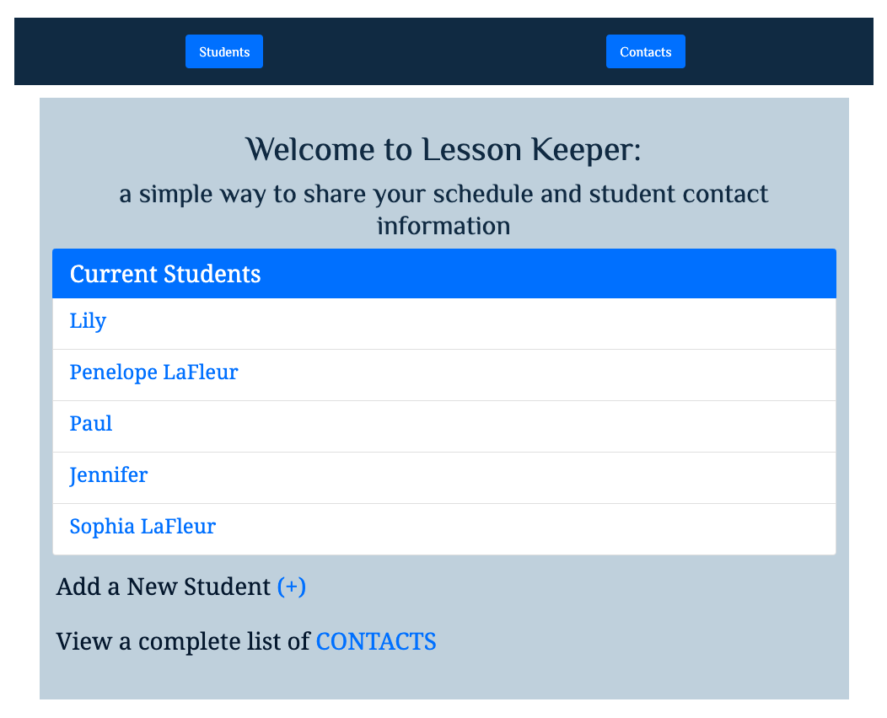
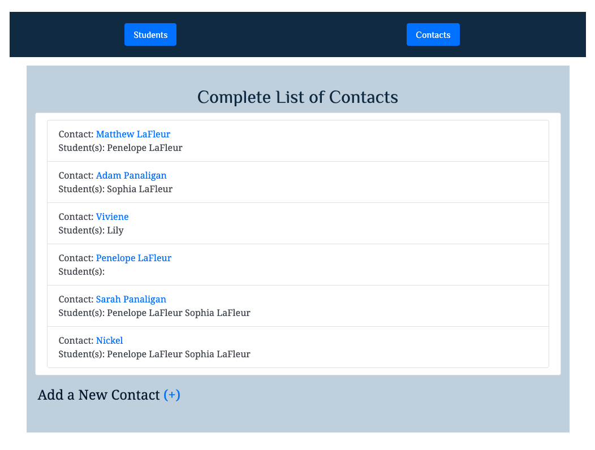
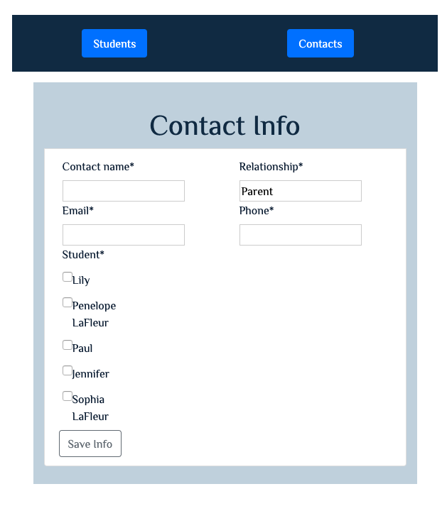

# lessonKeeper
An app that allows instructors of individual lessons to track weekly lesson times and store contact information for other students to access in case of a missed session.

## idea and background

Initially, I wanted to create an application that would help teachers who schedule one to one lessons. My children
 have been taking string lessons for over a decade and every year we get an annual email with details about the
  entire studio contact information in case we need to miss a lesson. The format of this information is challenging
   to sort through and can even require a Google log in to access. As a parent, I want something that is easy to
    navigate, access, and read.
    
## contact list

This page is accessable from the loading page and also through the navigation bar. The easy access to the information
 is what is most important.
 
## CRUD

The app is full CRUD on both a student and contact model. That said, future development will include a login for the
 teachers who will be able to edit, delete, and/or update, while regular users (parents and students) will have read
  only capability on the live site.

## forms

This form view shows required fields with * and also allows contacts to register multiple children.

## technologies used
<ul>
<li>Django</li>
<li>Python 3</li>
<li>Bootstrap</li>
<li>PostgreSQL</li>
</ul>

## future development

I intend to deploy this to Heroku in the next few weeks as I continue to build out my portfolio. Please visit my
 [website](https://spiano.dev) for more work examples. 
